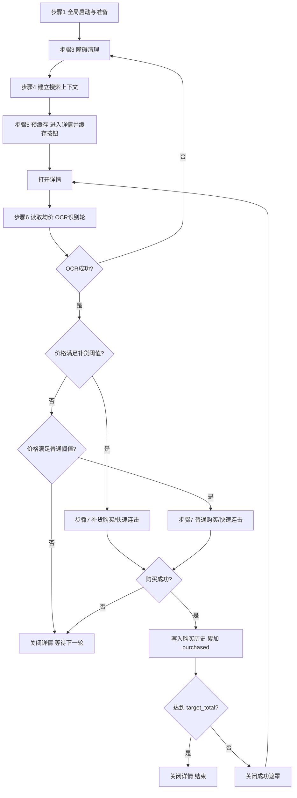

# 单商品流程 Rust 实现说明

本文先对齐 Python `single_purchase_runner_v2.py` 的真实流程，再说明当前 Rust/Tauri 版本采用的单任务实现边界。

当前 Rust 约束：

- 不实现 `task_mode`
- 不实现单商品任务列表调度
- 单商品页只维护一条任务配置
- 点击“开始”时只执行这一条任务

## Python v2 流程图

## Python v2 每步使用的配置与资源

### 步骤1 全局启动与准备

- 代码入口：`src/super_buyer/core/launcher.py`
- 主要配置：
  - `game.exe_path`
  - `game.launch_args`
  - `game.launcher_timeout_sec`
  - `game.launch_click_delay_sec`
  - `game.startup_timeout_sec`
- 主要模板：
  - `btn_launch`
  - `home_indicator`
  - `market_indicator`

### 步骤3 障碍清理

- 代码入口：`step3_clear_obstacles()`
- 主要时序配置：
  - `multi_snipe_tuning.post_close_detail_sec`
  - `multi_snipe_tuning.post_success_click_sec`
- 主要模板：
  - `btn_buy`
  - `btn_close`
  - `buy_ok`

### 步骤4 搜索与列表定位

- 代码入口：`step4_build_search_context()`
- 主要模板：
  - `btn_home`
  - `btn_market`
  - `input_search`
  - `btn_search`
  - 商品图片模板：`goods.image_path`
- 主要数据：
  - `goods.search_name`

### 步骤5 预缓存

- 代码入口：`precache_detail_once()`
- 主要模板：
  - `btn_buy`
  - `btn_close`
  - `btn_max`
  - `qty_minus`
  - `qty_plus`
- 主要时序配置：
  - `multi_snipe_tuning.detail_open_settle_sec`
  - `multi_snipe_tuning.detail_cache_verify_timeout_sec`

### 步骤6 读取均价

- 代码入口：
  - `_read_avg_price_with_rounds()`
  - `_read_avg_unit_price()`
- 主要配置：
  - `avg_price_area.distance_from_buy_top`
  - `avg_price_area.height`
  - `avg_price_area.scale`
  - `umi_ocr.base_url`
  - `umi_ocr.timeout_sec`
  - `multi_snipe_tuning.ocr_round_window_sec`
  - `multi_snipe_tuning.ocr_round_step_sec`
  - `multi_snipe_tuning.ocr_round_fail_limit`
- 主要模板：
  - `btn_buy`
- 主要历史写入：
  - 价格历史：`services/history.py::append_price()`

### 步骤7 执行购买

- 代码入口：
  - 普通：`purchase_cycle()` 普通分支
  - 补货：`_restock_fast_loop()`
- 主要配置：
  - `task.price_threshold`
  - `task.price_premium_pct`
  - `task.restock_price`
  - `task.restock_premium_pct`
  - `task.target_total`
  - `multi_snipe_tuning.buy_result_timeout_sec`
  - `multi_snipe_tuning.buy_result_poll_step_sec`
  - `multi_snipe_tuning.fast_chain_mode`
  - `multi_snipe_tuning.fast_chain_max`
  - `multi_snipe_tuning.fast_chain_interval_ms`
- 主要模板：
  - `btn_buy`
  - `buy_ok`
  - `buy_fail`
  - `btn_max`
  - `qty_minus`
  - `qty_plus`
- 主要历史写入：
  - 购买历史：`services/history.py::append_purchase()`

### 步骤8 会话内循环与处罚

- 代码入口：
  - `_check_and_handle_penalty()`
- 主要配置：
  - `task.target_total`
  - `multi_snipe_tuning.poll_step_sec`
  - `multi_snipe_tuning.ocr_miss_penalty_threshold`
  - `multi_snipe_tuning.penalty_confirm_delay_sec`
  - `multi_snipe_tuning.penalty_wait_sec`
- 主要模板：
  - `penalty_warning`
  - `btn_penalty_confirm`

## 当前 Rust 单任务实现映射

Rust 版核心文件：

- `desktop/src-tauri/src/automation/single_runner.rs`
- `desktop/src-tauri/src/automation/input.rs`
- `desktop/src-tauri/src/automation/vision.rs`
- `desktop/src-tauri/src/automation/ocr.rs`
- `desktop/src-tauri/src/runtime/manager.rs`

当前 Rust 版行为：

- 启动前先检查首页/市场模板；未命中时走启动器链路。
- 只执行一条单商品任务；优先取第一条启用任务。
- 以活动游戏窗口为搜索与截图上下文，模板匹配和 OCR 都在该窗口内完成。
- 支持：
  - 搜索商品
  - 进入详情
  - 详情按钮缓存
  - 平均价 OCR 识别轮
  - 普通购买
  - 补货购买
  - 快速连击
  - 价格历史写入
  - 购买历史写入
  - `single_task.purchased` 回写
  - OCR 处罚确认链路
  - 暂停/继续标志

## 与 Python 的有意差异

- Rust 单商品不做任务列表调度。
- Rust 单商品不使用时间窗口，运行后只按“达到总购买数量”或“手动终止”退出。
- Rust 单商品页只保留一条任务配置。
